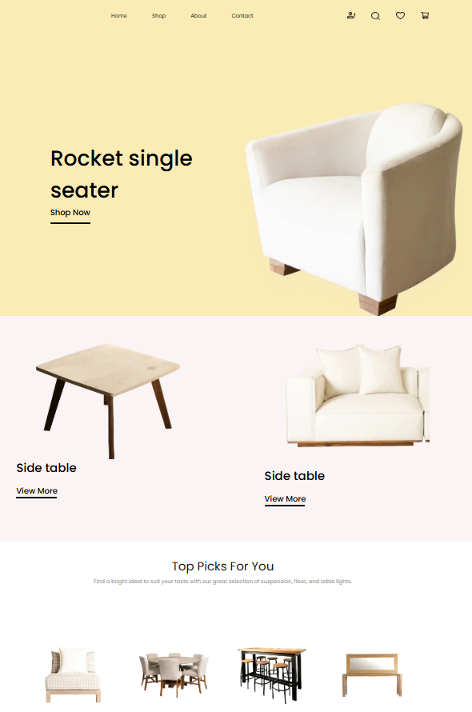

# Furniture Store 🪑

Furniture Store is a modern online furniture store built on Next.js. The user can browse the catalog, add items to cart, sort by price, check out delivery and log in. Implemented adaptive layout and light animations to improve user experience.

## 🚀 Technology Stack

- **Next. js** - framework for React applications
- **MongoDB (Atlas)** - database for storing users and products
- **React Hook Form** - validation of registration and checkout forms
- **Redux** - cart state management
- **SCSS Modules** - component styling
- **Tailwind CSS** - partial styling of UI elements
- **Framer Motion** - minimal animations
- **JWT + Bcrypt** - authorization and password encryption

## 🛠 Functionality

- 🔐 Registration and login
- 🛒 Shopping cart with adding and removing items
- 🔄 Sorting items by price (ascending and descending)
- 📦 Checkout delivery
- 📱 Fully adaptive interface
- 📊 Product pagination
- ✨ Animations when loading items
- 🌐 Demo: [furnitore-store. vercel.app](https://furnitore-store-476y21123.vercel.app/)

## 🖥 Screenshots

 <!-- Correct path to match your repository -->

## 📦 Install and run

```bash
git clone https://github.com/Oleksandr004/furnitore-store
cd furnitore-store
npm install
npm run dev
```
